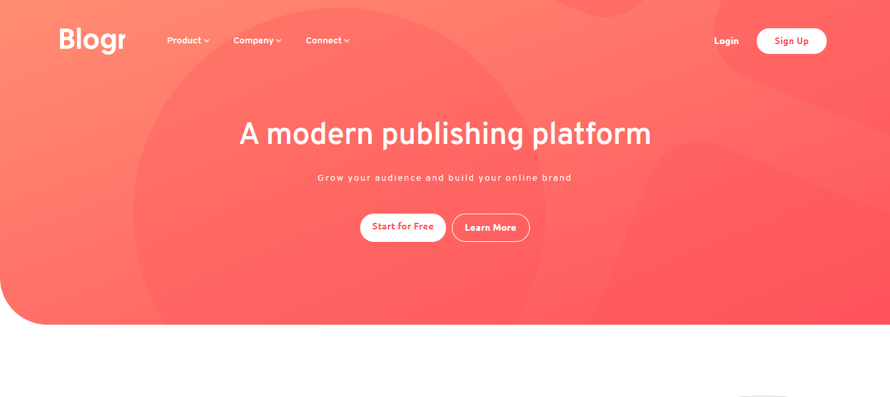
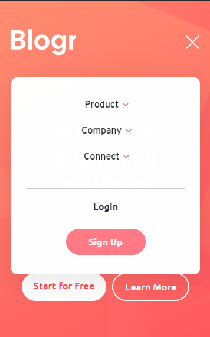

# Frontend Mentor - Blogr landing page solution

This is a solution to the [Blogr landing page challenge on Frontend Mentor](https://www.frontendmentor.io/challenges/blogr-landing-page-EX2RLAApP). Frontend Mentor challenges help you improve your coding skills by building realistic projects.

## Table of contents

- [Overview](#overview)
  - [The challenge](#the-challenge)
  - [Screenshot](#screenshot)
  - [Links](#links)
- [My process](#my-process)
  - [Built with](#built-with)
  - [What I learned](#what-i-learned)
- [Author](#author)

**Note: Delete this note and update the table of contents based on what sections you keep.**

## Overview

### The challenge

Users should be able to:

- View the optimal layout for the site depending on their device's screen size
- See hover states for all interactive elements on the page

### Screenshot

### Links

- Solution URL: [Click Here](https://www.frontendmentor.io/challenges/blogr-landing-page-EX2RLAApP/hub/using-bootstrap-flexbox-vanilla-js-and-animate-js-NtPvc98HI)
- Live Site URL: [Click Here](https://blogr-landing-page-main-amber.vercel.app/)

### Built with

- Semantic HTML5 markup
- Sass CSS Preprocessor
- Flexbox
- Vanilla JS
- Animate JS

### What I learned

- From this challenge I learned how to make a responsive navigation bar using a Vanilla Javasricpt only.
- At first, I thought about using the navigation bar from the CSS framework, but I was curious and interested in making it manually using javascript, and finakky i can do that.
- I tried to write CSS with Sass preprocessor that i have learned before.

## Author

- Website - [Add your name here](https://riansyh.github.io/portfolio/)
- Frontend Mentor - [@yourusername](https://www.frontendmentor.io/profile/riansyh)
- Instagram - [@yourusername](https://www.instagram.com/rian.fbrsyh)
